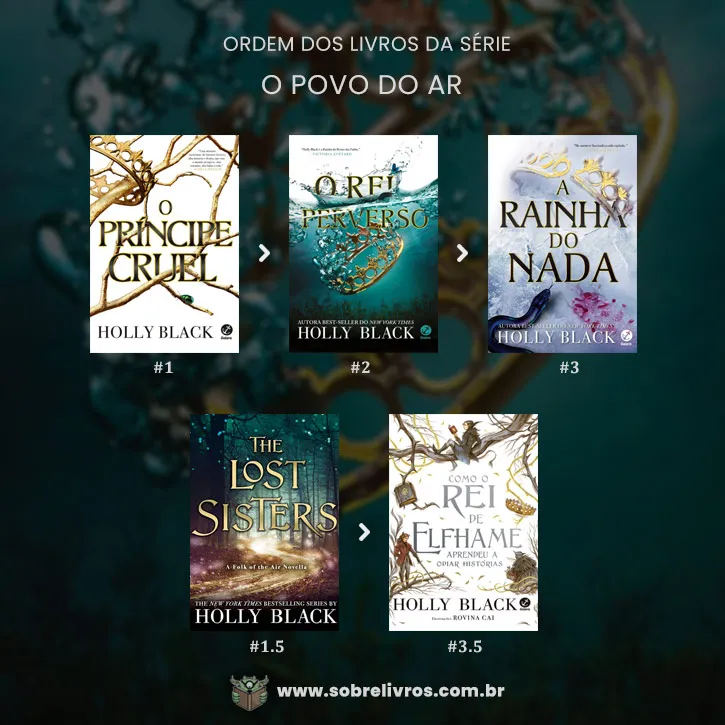

# projeto-front-end-Luana-Borges
  Eu fiz o trabalho sobre a saga de livros "O povo do ar" porque achei que renderia conteúdo e também porque eu achei mais interessante de criar. 
  Tive alguns problemas com o CSS e fui nos documentos do classrrom para conseguir estilizar o trabalho e me baseei nos códigos de lá, a cor de fundo e as cores dos titúlos estão no HTML já que o que li na documentação explicava assim. 
  
  Usei essa imagem e mudei o tamanho dela de acordo com a documentação. 
  Estou terminando o trabalho pelo computador da minha casa mas ele é bem ruinzinho e trava muito, não estou conseguindo tirar print do trabalho por aqui mas vou mandar junto com o link do repositório para você conseguir ver. 
